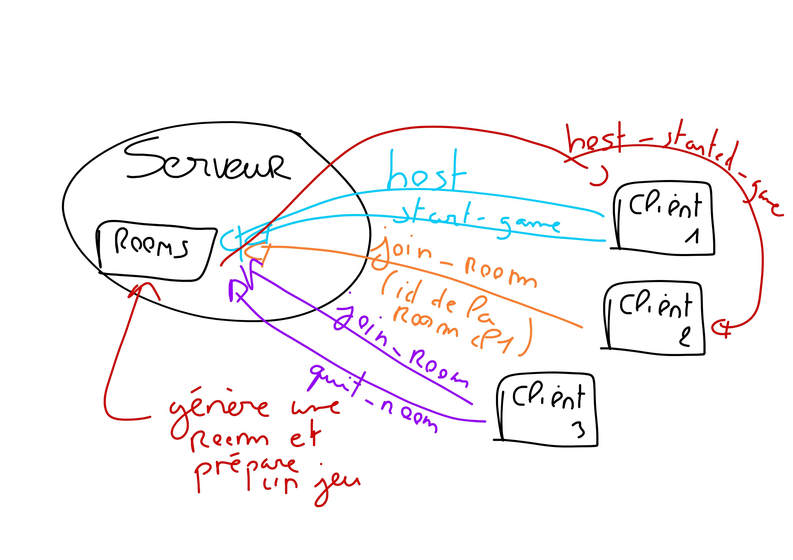

# JSaÉ - Space Invaders ++

## Communcation avec le serveur

## Difficultés Rencontrées

Moi et Thomas avons fait face à diverses difficultés lors de cette SAE. Tout d'abord, l'absence totale de Kylian, qui ne s'est jamais manifesté pendant cette période, nous a posé problème à nous deux. Cela a compliqué notre travail de manière significative.  
Heureusement, grâce aux solides connaissances de Thomas, nous avons pu progresser du mieux que possible malgré tout. Une autre difficulté à laquelle nous avons été confrontés a été l'installation correcte de TypeScript et du serveur. Contrairement à nos TPs où nous utilisons webpack, nous avons opté pour ViteJS. Non seulement il prend en charge TypeScript, mais il est également plus optimisé que webpack. De plus, sa configuration nous a semblé plus simple à gérer.  

## Perspectives d'Amélioration 🚀  

Le jeu est fonctionnel, mais il est clair qu'il n'est pas parfait. Nous n'avons pas encore implémenté la compatibilité avec les téléphones ou les manettes, ce qui aurait pu apporter un avantage supplémentaire au projet. De plus, nous n'avons pas intégré de système de "level cap". Actuellement, la difficulté augmente à mesure que le joueur progresse, mais nous aurions aimé avoir plus de temps pour concevoir un système de paliers plus élaboré.  

## Notre Réussite 💪

Notre fierté réside dans le fait que nous avons réussi à créer un jeu en TypeScript sans solliciter l'aide des professeurs. 
